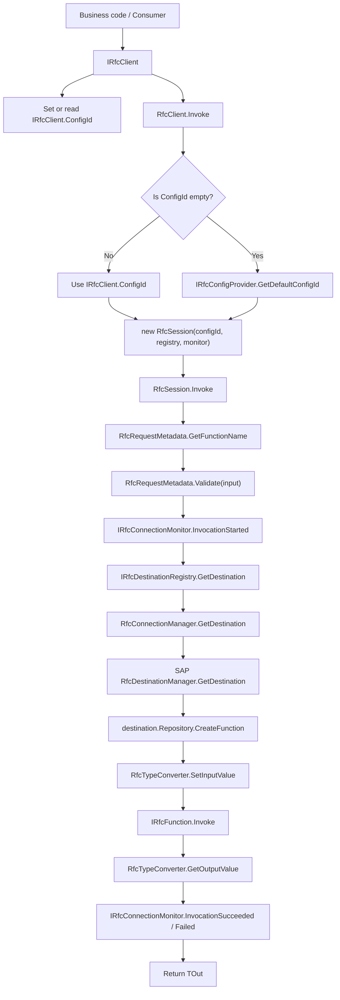
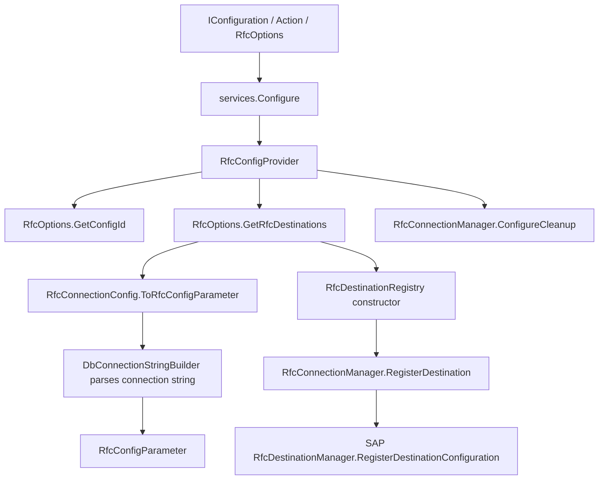
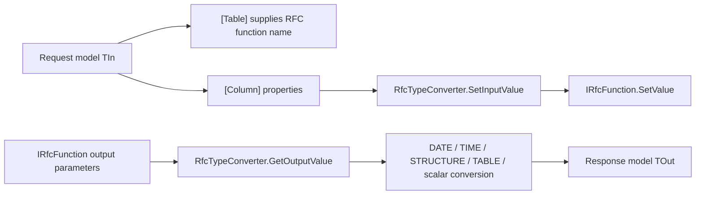
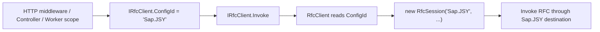

# RfcClient File Dependency Roadmap

Generated on: 2026-07-09

## 1. Analysis Scope

This roadmap is based on the repository source files, project file, solution file, and README. It focuses on:

- `*.cs` source files
- `RfcClient.csproj`
- `RfcClient.sln`
- `README.md`

`bin/`, `obj/`, and SAP NCo runtime DLLs under `libs/` are not treated as business source code.

## 2. Project Positioning

`RfcClient` is a dependency-injection-friendly SAP RFC client wrapper. It packages SAP .NET Connector destination registration, destination caching, RFC function creation, request/response mapping, and invocation monitoring behind a scoped `IRfcClient`.

The public implementation namespace is `mitzh`, and the interface namespace is `mitzh.Abstractions`. The client supports both constructor injection and Autofac Module property injection.

The current public entry point is:

- `IRfcClient.ConfigId`: the current scoped SAP RFC config ID. Empty means the default configured destination is used.
- `IRfcClient.Invoke<TOut>(object input, string functionName = null, bool forceNew = false)`: executes a typed RFC call.

## 3. Top-Level Source Map

```text
RfcClient/
├─ RfcClient.csproj
├─ RfcClient.sln
├─ README.md
├─ Abstractions/
│  ├─ IRfcClient.cs
│  ├─ IRfcConfigProvider.cs
│  ├─ IRfcDestinationRegistry.cs
│  └─ IRfcConnectionMonitor.cs
├─ RfcServiceCollectionExtensions.cs
├─ RfcClient.cs
├─ RfcSession.cs
├─ RfcOptions.cs
├─ RfcConfigProvider.cs
├─ RfcConfigParameter.cs
├─ RfcDestinationRegistry.cs
├─ RfcConnectionManager.cs
├─ RfcTypeConverter.cs
├─ RfcRequestMetadata.cs
├─ RfcConnectionMonitor.cs
└─ RfcMonitoringContexts.cs
```

## 4. Main Dependency Roadmap



## 5. Configuration Parsing and Destination Registration



## 6. Type Conversion Flow



## 7. File-Level Dependency Table

| File | Primary responsibility | Depends on / calls | Used by |
|---|---|---|---|
| `RfcClient.csproj` | Defines the class library, target framework, SAP NCo DLL references, Microsoft.Extensions packages, and package metadata | `libs/*.dll`, `Microsoft.Extensions.*` | `RfcClient.sln`, build tooling |
| `RfcClient.sln` | Visual Studio solution entry point | `RfcClient.csproj` | IDE / build tooling |
| `README.md` | User guide, configuration examples, model examples, build and pack instructions | Public project APIs | Users and maintainers |
| `Abstractions/IRfcClient.cs` | Main public invocation interface with `ConfigId` and `Invoke` | No internal dependency | `RfcClient`, business code |
| `Abstractions/IRfcConfigProvider.cs` | Provides default config ID and resolved RFC configuration parameters | `RfcConfigParameter` | `RfcConfigProvider`, `RfcClient`, `RfcDestinationRegistry` |
| `Abstractions/IRfcDestinationRegistry.cs` | Abstracts destination lookup and config queries | `RfcDestination`, `RfcConfigParameter` | `RfcDestinationRegistry`, `RfcSession` |
| `Abstractions/IRfcConnectionMonitor.cs` | Exposes destination and invocation lifecycle callbacks | `RfcDestinationResolvedContext`, `RfcInvocationContext` | `RfcConnectionMonitor`, `RfcDestinationRegistry`, `RfcSession` |
| `RfcServiceCollectionExtensions.cs` | DI registration entry point with four `AddRfcClient` overloads | `IConfiguration`, `IServiceCollection`, abstractions, implementations | Application startup code |
| `RfcClient.cs` | Scoped `IRfcClient` implementation; resolves `ConfigId` and creates a short-lived `RfcSession` | `IRfcDestinationRegistry`, `IRfcConfigProvider`, `IRfcConnectionMonitor`, `RfcSession` | Registered as `IRfcClient` |
| `RfcSession.cs` | Internal execution object for one RFC call: metadata lookup, validation, destination lookup, function invocation, monitoring callbacks, exception wrapping | `IRfcDestinationRegistry`, `IRfcConnectionMonitor`, `RfcRequestMetadata`, `RfcTypeConverter`, SAP NCo, `IDisposable` | `RfcClient` |
| `RfcOptions.cs` | Stores config list, default-config logic, and connection-string parsing entry point | `DbConnectionStringBuilder`, `RfcConfigParameter` | `RfcConfigProvider`, DI options |
| `RfcConfigProvider.cs` | Adapts `IOptions<RfcOptions>` to config-provider abstraction and configures connection cleanup | `RfcOptions`, `RfcConnectionManager.ConfigureCleanup` | `RfcClient`, `RfcDestinationRegistry` |
| `RfcConfigParameter.cs` | SAP RFC connection parameter data structure | No internal dependency | `RfcOptions`, `RfcConnectionManager`, monitoring contexts |
| `RfcDestinationRegistry.cs` | Registers all configured destinations and wraps destination lookup with monitoring | `IRfcConfigProvider`, `IRfcConnectionMonitor`, `RfcConnectionManager` | `RfcSession` |
| `RfcConnectionManager.cs` | Process-wide SAP destination registration, caching, cleanup, and NCo `IDestinationConfiguration` implementation | SAP NCo, `RfcConfigParameter`, `Timer`, concurrent dictionaries | `RfcDestinationRegistry`, `RfcConfigProvider` |
| `RfcTypeConverter.cs` | `IRfcFunction` input/output extension methods for object, structure, table, date, time, and scalar conversion | SAP NCo, `ColumnAttribute` | `RfcSession` |
| `RfcRequestMetadata.cs` | Centralizes `[Table]` RFC function-name lookup and DataAnnotations validation | `TableAttribute`, `Validator` | `RfcSession` |
| `RfcConnectionMonitor.cs` | Default no-op monitor implementation that users can replace | `IRfcConnectionMonitor` | Default DI registration |
| `RfcMonitoringContexts.cs` | Monitoring context objects | `RfcDestination`, `RfcConfigParameter`, `Type`, timestamps | `IRfcConnectionMonitor`, `RfcDestinationRegistry`, `RfcSession` |

## 8. DI Registration Details

`RfcServiceCollectionExtensions.AddRfcClientCore` currently registers:

| Abstraction | Implementation | Lifetime | Notes |
|---|---|---|---|
| `IRfcConnectionMonitor` | `RfcConnectionMonitor` | Singleton | Default no-op implementation; callers may register their own monitor first |
| `IRfcConfigProvider` | `RfcConfigProvider` | Singleton | Reads options and configures cleanup settings |
| `IRfcDestinationRegistry` | `RfcDestinationRegistry` | Singleton | Registers all destinations during construction |
| `IRfcClient` | `RfcClient` | Scoped | Main business-code entry point; owns the current scoped `ConfigId` |

## 9. Key Runtime Paths

### 9.1 Startup Registration Path

1. The application calls `builder.Services.AddRfcClient(configuration)`.
2. Configuration is bound to `RfcOptions`.
3. DI registers the config provider, destination registry, monitor, and scoped client.
4. `RfcConfigProvider` reads cleanup options and calls `RfcConnectionManager.ConfigureCleanup(...)`.
5. `RfcDestinationRegistry` enumerates all `RfcConnectionConfigs` during construction.
6. Each config is converted with `RfcConnectionConfig.ToRfcConfigParameter()`.
7. Each `ConfigId` is registered through `RfcConnectionManager.RegisterDestination(...)`.
8. `RfcConnectionManager` registers its SAP NCo `IDestinationConfiguration` once through `RfcDestinationManager.RegisterDestinationConfiguration(...)`.

### 9.2 Default Business Invocation Path

1. Business code injects `IRfcClient`.
2. Optional: set `_rfcClient.ConfigId = "Sap.JSY"`.
3. It calls `Invoke<TOut>(input, functionName, forceNew)`.
4. `RfcClient` first uses its own `ConfigId`.
5. If `ConfigId` is empty, it uses `IRfcConfigProvider.GetDefaultConfigId()`.
6. `RfcClient` creates `RfcSession`.
7. `RfcSession` reads the RFC function name, validates input, resolves the destination, invokes SAP RFC, and converts the response.
8. On success, it raises `InvocationSucceeded`; on failure, it raises `InvocationFailed`.
9. It returns the typed response `TOut`.

### 9.3 ConfigId Switching Path



`IRfcClient` is scoped, so the same request scope resolves the same `RfcClient` instance. After setting `ConfigId`, subsequent calls use that config; setting it to an empty string returns the scope to the default config.

## 10. Runtime State and Caching

`RfcConnectionManager` stores process-wide state in static fields:

- `_destinations`: maps `ConfigId` to `RfcConfigParameter`.
- `_destinationCache`: maps `ConfigId` to cached `RfcDestination`.
- `_lastAccessTime`: tracks last access for idle cleanup.
- `_cleanupTimer`: periodically removes idle cached destinations.
- `_configurationRegistered`: ensures SAP NCo destination configuration is registered once.

When `forceNew = true`, `RfcConnectionManager.GetDestination` removes the cached destination for the given name and asks SAP NCo for a fresh destination.

## 11. Maintenance Observations

| Observation | Details |
|---|---|
| `IRfcClient.ConfigId` is scoped state | Do not register `IRfcClient` as singleton, otherwise different requests can share config state. |
| `RfcConnectionManager` uses static global state | Multiple tests, multiple hosts, or multiple option sets in one process need to account for shared state, cache reuse, and cleanup timing. |
| `RfcDestinationRegistry` registers all destinations during construction | Configuration errors may surface when the singleton is resolved, before the first RFC call. |
| No test project is present | The repository currently shows no test project. Config parsing, `ConfigId` selection, type conversion, and cache behavior are good test candidates. |

## 12. Recommended Reading Order

1. `README.md`
2. `RfcServiceCollectionExtensions.cs`
3. `Abstractions/IRfcClient.cs`
4. `RfcClient.cs`
5. `RfcSession.cs`
6. `RfcDestinationRegistry.cs`
7. `RfcConnectionManager.cs`
8. `RfcOptions.cs`
9. `RfcTypeConverter.cs`
10. `RfcConnectionMonitor.cs` and `RfcMonitoringContexts.cs`

## 13. One-Sentence Architecture Summary

The main project line is: `DI registration -> IRfcClient owns scoped ConfigId -> RfcClient creates RfcSession -> SAP Destination lookup/cache -> attribute-based SAP RFC invocation -> typed response conversion -> monitor lifecycle callbacks`.
