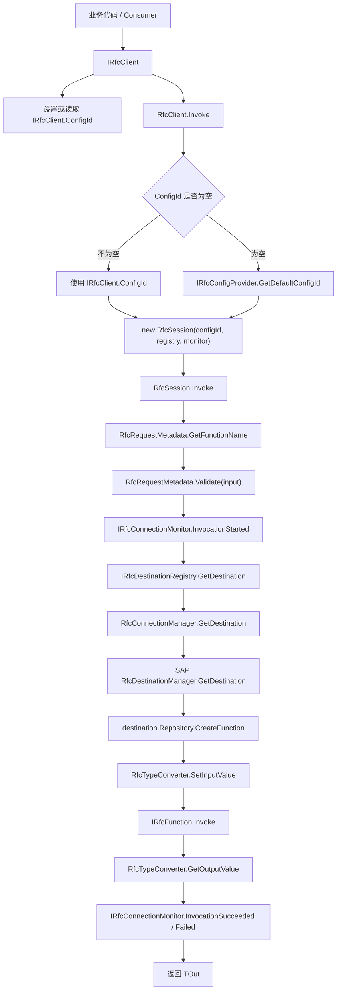
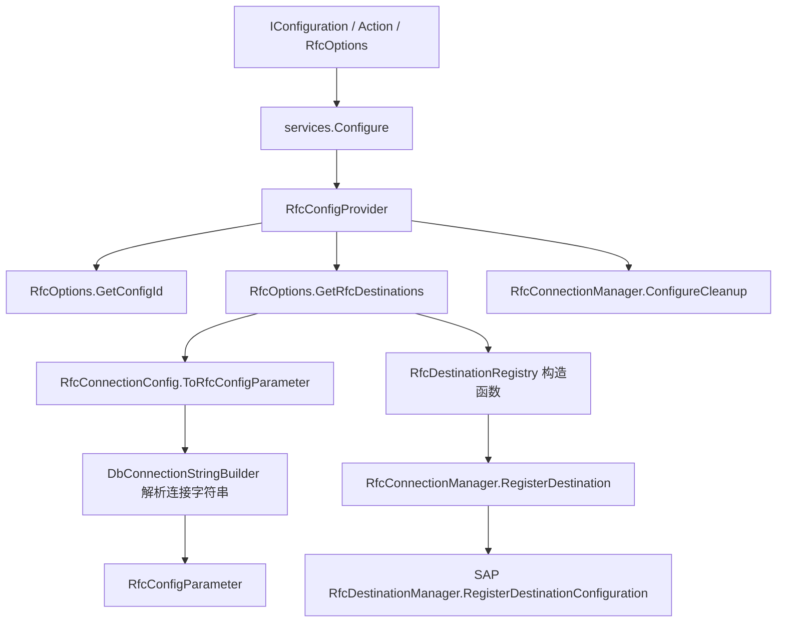
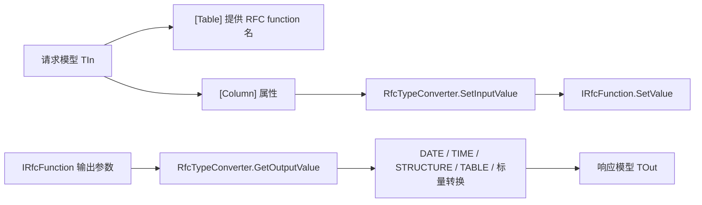
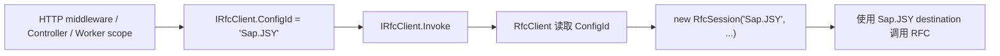

# RfcClient 文件调用依赖路线图

生成日期：2026-07-09

## 1. 分析范围

本路线图基于源码文件、项目文件和 README 进行分析，重点覆盖：

- `*.cs` 源码文件
- `RfcClient.csproj`
- `RfcClient.sln`
- `README.md`

`bin/`、`obj/` 构建产物，以及 `libs/` 下的 SAP NCo 运行时 DLL 不作为业务源码分析对象。

## 2. 项目定位

`RfcClient` 是一个面向依赖注入的 SAP RFC 客户端封装库。它将 SAP .NET Connector 的 destination 注册、连接缓存、RFC function 创建、请求/响应映射和调用监控包装成一个 scoped `IRfcClient`。

公开命名空间为 `mitzh`，接口命名空间为 `mitzh.Abstractions`。客户端既支持构造函数注入，也支持 Autofac Module 的属性注入。

当前对外主入口是：

- `IRfcClient.ConfigId`：当前 scope 内的 SAP RFC 配置 ID。为空时使用默认配置。
- `IRfcClient.Invoke<TOut>(object input, string functionName = null, bool forceNew = false)`：执行强类型 RFC 调用。

## 3. 顶层源码地图

```text
RfcClient/
├─ RfcClient.csproj
├─ RfcClient.sln
├─ README.md
├─ Abstractions/
│  ├─ IRfcClient.cs
│  ├─ IRfcConfigProvider.cs
│  ├─ IRfcDestinationRegistry.cs
│  └─ IRfcConnectionMonitor.cs
├─ RfcServiceCollectionExtensions.cs
├─ RfcClient.cs
├─ RfcSession.cs
├─ RfcOptions.cs
├─ RfcConfigProvider.cs
├─ RfcConfigParameter.cs
├─ RfcDestinationRegistry.cs
├─ RfcConnectionManager.cs
├─ RfcTypeConverter.cs
├─ RfcRequestMetadata.cs
├─ RfcConnectionMonitor.cs
└─ RfcMonitoringContexts.cs
```

## 4. 主调用依赖路线图



## 5. 配置解析与 Destination 注册路线



## 6. 类型转换路线



## 7. 文件级依赖表

| 文件 | 主要职责 | 依赖 / 调用 | 被谁使用 |
|---|---|---|---|
| `RfcClient.csproj` | 定义类库、目标框架、SAP NCo DLL 引用、Microsoft.Extensions 包引用和打包配置 | `libs/*.dll`、`Microsoft.Extensions.*` | `RfcClient.sln`、构建工具 |
| `RfcClient.sln` | Visual Studio 解决方案入口 | `RfcClient.csproj` | IDE / 构建工具 |
| `README.md` | 用户使用说明、配置示例、模型示例、构建打包说明 | 项目公开 API | 使用者和维护者 |
| `Abstractions/IRfcClient.cs` | 对外主调用接口，包含 `ConfigId` 和 `Invoke` | 无项目内依赖 | `RfcClient`、业务代码 |
| `Abstractions/IRfcConfigProvider.cs` | 提供默认配置 ID 与配置参数 | `RfcConfigParameter` | `RfcConfigProvider`、`RfcClient`、`RfcDestinationRegistry` |
| `Abstractions/IRfcDestinationRegistry.cs` | 抽象 destination 获取与配置查询 | `RfcDestination`、`RfcConfigParameter` | `RfcDestinationRegistry`、`RfcSession` |
| `Abstractions/IRfcConnectionMonitor.cs` | 暴露连接解析和调用生命周期监控点 | `RfcDestinationResolvedContext`、`RfcInvocationContext` | `RfcConnectionMonitor`、`RfcDestinationRegistry`、`RfcSession` |
| `RfcServiceCollectionExtensions.cs` | DI 注册入口，提供四个 `AddRfcClient` 重载 | `IConfiguration`、`IServiceCollection`、抽象接口和实现类 | 应用启动代码 |
| `RfcClient.cs` | scoped `IRfcClient` 实现；解析 `ConfigId` 并创建短生命周期 `RfcSession` | `IRfcDestinationRegistry`、`IRfcConfigProvider`、`IRfcConnectionMonitor`、`RfcSession` | DI 注册为 `IRfcClient` |
| `RfcSession.cs` | 内部执行对象，执行一次 RFC 调用，包含元数据解析、校验、destination 获取、function 调用、监控回调和异常包装 | `IRfcDestinationRegistry`、`IRfcConnectionMonitor`、`RfcRequestMetadata`、`RfcTypeConverter`、SAP NCo、`IDisposable` | `RfcClient` |
| `RfcOptions.cs` | 保存配置列表、默认配置逻辑、连接字符串解析入口 | `DbConnectionStringBuilder`、`RfcConfigParameter` | `RfcConfigProvider`、DI options |
| `RfcConfigProvider.cs` | 将 `IOptions<RfcOptions>` 适配为配置提供者，并配置连接清理参数 | `RfcOptions`、`RfcConnectionManager.ConfigureCleanup` | `RfcClient`、`RfcDestinationRegistry` |
| `RfcConfigParameter.cs` | SAP RFC 连接参数数据结构 | 无项目内依赖 | `RfcOptions`、`RfcConnectionManager`、监控上下文 |
| `RfcDestinationRegistry.cs` | 注册所有配置到连接管理器，并包装 destination 获取与监控 | `IRfcConfigProvider`、`IRfcConnectionMonitor`、`RfcConnectionManager` | `RfcSession` |
| `RfcConnectionManager.cs` | 进程级 SAP destination 注册、缓存、清理和 NCo `IDestinationConfiguration` 实现 | SAP NCo、`RfcConfigParameter`、`Timer`、并发字典 | `RfcDestinationRegistry`、`RfcConfigProvider` |
| `RfcTypeConverter.cs` | `IRfcFunction` 输入/输出扩展方法，负责对象、结构、表、日期、时间和标量转换 | SAP NCo、`ColumnAttribute` | `RfcSession` |
| `RfcRequestMetadata.cs` | 集中解析 `[Table]` RFC function 名并执行 DataAnnotations 校验 | `TableAttribute`、`Validator` | `RfcSession` |
| `RfcConnectionMonitor.cs` | 默认空实现监控器，允许用户替换 | `IRfcConnectionMonitor` | DI 默认注册 |
| `RfcMonitoringContexts.cs` | 监控上下文对象 | `RfcDestination`、`RfcConfigParameter`、`Type`、时间戳 | `IRfcConnectionMonitor`、`RfcDestinationRegistry`、`RfcSession` |

## 8. DI 注册依赖

`RfcServiceCollectionExtensions.AddRfcClientCore` 当前注册：

| 抽象 | 实现 | 生命周期 | 说明 |
|---|---|---|---|
| `IRfcConnectionMonitor` | `RfcConnectionMonitor` | Singleton | 默认空实现，用户可提前注册自己的实现 |
| `IRfcConfigProvider` | `RfcConfigProvider` | Singleton | 从 options 读取配置，并配置连接清理参数 |
| `IRfcDestinationRegistry` | `RfcDestinationRegistry` | Singleton | 构造时注册所有 destination |
| `IRfcClient` | `RfcClient` | Scoped | 业务代码注入的主入口，持有当前 scope 的 `ConfigId` |

## 9. 关键运行路径

### 9.1 启动注册路径

1. 应用调用 `builder.Services.AddRfcClient(configuration)`。
2. 配置绑定到 `RfcOptions`。
3. DI 注册配置提供者、destination registry、监控器和 scoped client。
4. `RfcConfigProvider` 构造时读取 cleanup 参数并调用 `RfcConnectionManager.ConfigureCleanup(...)`。
5. `RfcDestinationRegistry` 构造时枚举所有 `RfcConnectionConfigs`。
6. 每个配置被 `RfcConnectionConfig.ToRfcConfigParameter()` 转换。
7. 每个 `ConfigId` 注册到 `RfcConnectionManager.RegisterDestination(...)`。
8. `RfcConnectionManager` 首次注册时调用 SAP NCo 的 `RfcDestinationManager.RegisterDestinationConfiguration(...)`。

### 9.2 默认业务调用路径

1. 业务类注入 `IRfcClient`。
2. 可选：设置 `_rfcClient.ConfigId = "Sap.JSY"`。
3. 调用 `Invoke<TOut>(input, functionName, forceNew)`。
4. `RfcClient` 优先使用自身 `ConfigId`。
5. 如果 `ConfigId` 为空，则使用 `IRfcConfigProvider.GetDefaultConfigId()`。
6. `RfcClient` 创建 `RfcSession`。
7. `RfcSession` 读取 RFC function 名、校验输入、获取 destination、执行 SAP RFC、转换响应。
8. 成功时通知 `InvocationSucceeded`；失败时通知 `InvocationFailed`。
9. 返回响应对象 `TOut`。

### 9.3 ConfigId 切换路径



`IRfcClient` 是 scoped 生命周期，所以同一个请求 scope 中解析到的是同一个 `RfcClient` 实例。设置 `ConfigId` 后，后续调用会使用该配置；将其设为空字符串可回到默认配置。

## 10. 运行时状态与缓存

`RfcConnectionManager` 使用静态字段维护全进程状态：

- `_destinations`：`ConfigId` 到 `RfcConfigParameter` 的映射。
- `_destinationCache`：`ConfigId` 到 `RfcDestination` 的缓存。
- `_lastAccessTime`：记录最近访问时间，用于清理空闲 destination。
- `_cleanupTimer`：定时执行空闲 destination 清理。
- `_configurationRegistered`：确保只向 SAP NCo 注册一次 `IDestinationConfiguration`。

`forceNew = true` 时，`RfcConnectionManager.GetDestination` 会移除对应缓存，并从 SAP NCo 重新获取 destination。

## 11. 维护观察点

| 观察点 | 说明 |
|---|---|
| `IRfcClient.ConfigId` 是 scoped 状态 | 不要把 `IRfcClient` 注册为 singleton，否则不同请求之间会共享配置状态。 |
| `RfcConnectionManager` 是静态全局状态 | 多个测试、多个 Host 或多套 options 在同一进程内运行时需要注意状态复用、缓存和清理行为。 |
| `RfcDestinationRegistry` 构造时注册全部 destination | 配置错误可能在 DI 解析 singleton 时暴露，而不是第一次调用时才暴露。 |
| 缺少测试项目 | 当前未看到测试项目。建议补充配置解析、`ConfigId` 选择、类型转换和缓存行为测试。 |

## 12. 推荐阅读顺序

1. `README.md`
2. `RfcServiceCollectionExtensions.cs`
3. `Abstractions/IRfcClient.cs`
4. `RfcClient.cs`
5. `RfcSession.cs`
6. `RfcDestinationRegistry.cs`
7. `RfcConnectionManager.cs`
8. `RfcOptions.cs`
9. `RfcTypeConverter.cs`
10. `RfcConnectionMonitor.cs` 和 `RfcMonitoringContexts.cs`

## 13. 一句话架构总结

这个项目的主线是：`DI 注册 -> IRfcClient 持有 scope 内 ConfigId -> RfcClient 创建 RfcSession -> 获取/缓存 SAP Destination -> 通过属性映射调用 SAP RFC -> 将输出转换成 typed response -> 通过 monitor 暴露调用生命周期`。
